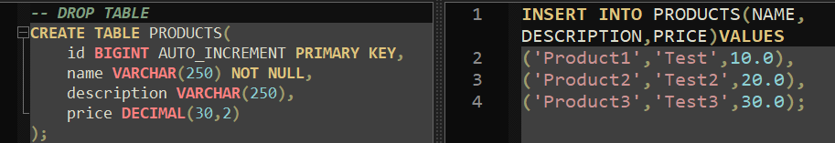
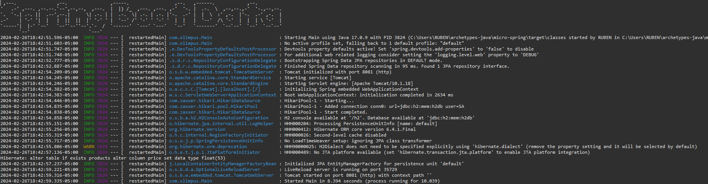
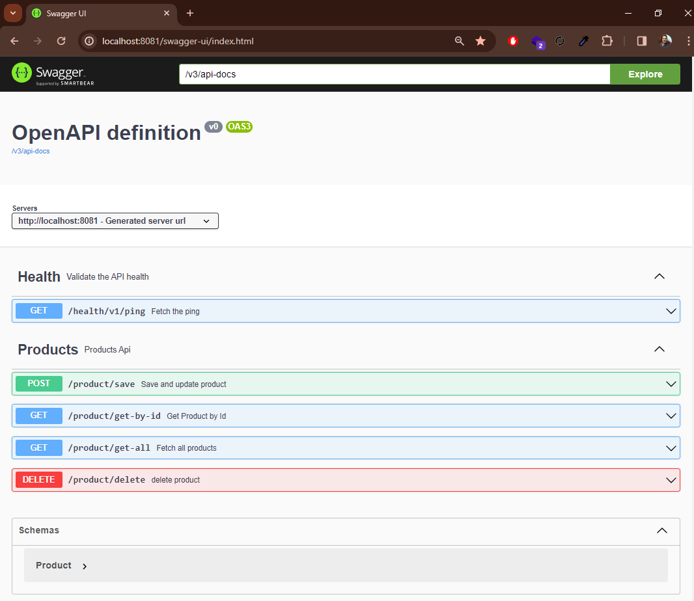
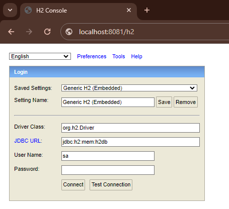
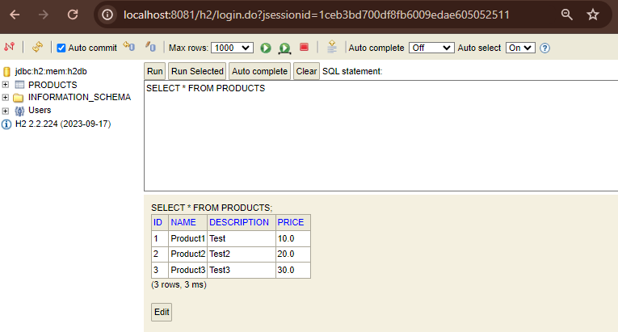

# Micro Spring 

This project generates a rough integration with RDS database.

## Tech Stack

**Java:** version 17

**Spring:** 3.2.2

**OpenApi:** V3

## Installation

Install micro-spring with maven

```bash
  mvn clean install micro-spring
```

You can change configurations in application.properties


You can create the structure for the database



## Deployment

To deploy this project run

```bash
  mvn spring-boot:run
```

## Spring Boot



## Swagger



## H2



## Authors

- [@Rubencho](https://github.com/rubenchomazo/)