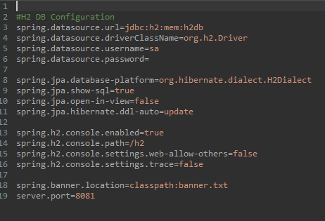
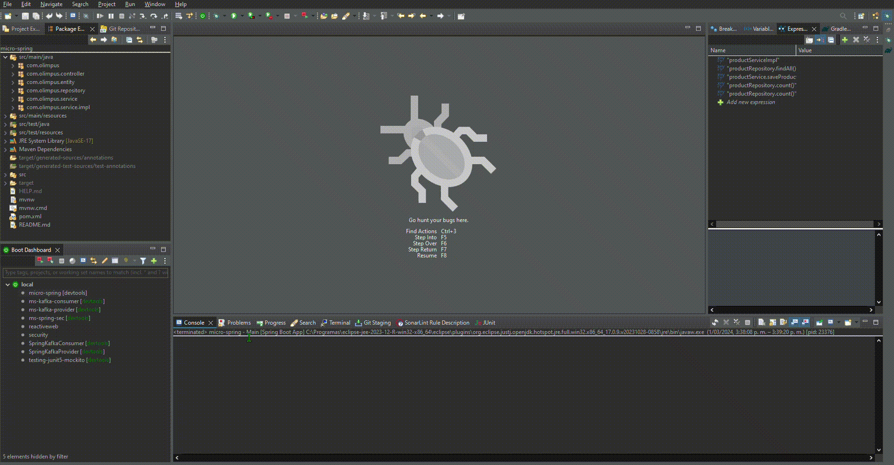

# Micro Spring 

This project generates a rough integration with RDS database.

## Tech Stack

**Java:** 17

**JUnit:** 5

**Spring:** 3.2.2

**Spring Data:** H2

**Swagger:** OpenApi V3

## Installation

Install micro-spring with maven

```bash
  mvn clean install micro-spring
```

You can change configurations in application.properties



You can create the structure for the database


## Deployment

To deploy this project run spring boot




## Swagger


## H2


## Authors

- [@Rubencho](https://github.com/rubenchomazo/)